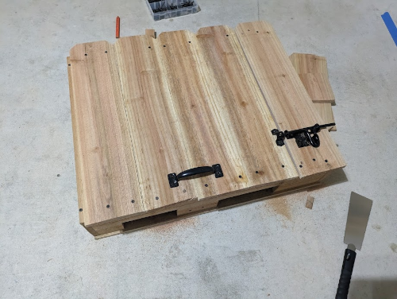

### Motivation for this project
Shortly after moving in to my current place, I reasoned that I needed an irrigation system to coordinate the occasional drip irrigation to my (mostly native) plants. In this part of Texas, droughts aren't really uncommon, unfortunately, so having this system set up would help provide some stability to the plants while not being much of a strain on my personal bandwidth to water the lawn, as well as the local water district's. Perhaps it goes without saying, but precisely applying water to plants where & when they need it instead of just spraying in their general direction goes a long way towards helping to conserve water while also keeping plants happy.

As to whether I could have simply bought something to supplement these needs, I'm sure the answer is a resounding 'yes'. My main problem with going this route is that such products that would be readily available for purchase on sites like Amazon rarely have all the details I'm looking for like:
 - how flexible is the system to automation?
 - are there multiple ways to supply it with power?
 - how does it function?
 - is there something about its internal mechanisms that might not warrant its application in this project?

All or most of that info isn't really available on most online marketplaces, so you're left relying on reviews elsewhere or just guess work. I determined from some experimentation that a typical solenoid valve wouldn't be ideal. Solenoid valves use energy to stay open (or closed!) and in using energy to stay open, they tend to heat up quite a bit. This heating could potentially lead to a failure in the valve. I didn't want such an easy way for the system to fail. The alternative that I ended up going with was a mechanized ball valve. These essentially only expend energy to turn a valve open or closed. Once the turning is done, it shuts off. This leads not only to less energy used, but also a (hopefully) more stable system.

Proving to myself that this was a worthy, attainable cause, I set up some goals for the project. This system needed:
 - to have at least 6 zones
 - to allow for manual control when needed, but otherwise accept automation cues
 - to be easily incorporated with the existing home automation network ([Home Assistant](https://www.home-assistant.io/))
 - to have reasonably replaceable parts
 - to allow for easy winterization (i.e., drain most of the water out of the exposed pipes)
 - to easily accept future improvements

### Getting started

The first thing I needed to figure out was materials needed. Using a garden hose for the whole thing may have been the easiest approach, but I had recently witnessed a garden hose get heated in the sun so much that part of its wall ruptured. It was probably a cheap hose, but I didn't want to go down the route of testing multiple hoses to see which one would work. 

I wanted to follow whatever standard there may be for this kind of thing. I read that [PEX](https://en.wikipedia.org/wiki/Cross-linked_polyethylene) was often used in homes for distributing water, so I concluded that this was the way to go. I researched methodologies for connecting pipes, types of connectors and limitations with it. Seemingly the only issue with PEX in my application was that it was very sensitive to UV light. I'd need to put whatever I build into a box. 

### Assembling the pipes

I read up on using the sharkbite fittings on pex and gave it a few dummy attempts before actually combining everything. You really needed to make sure that the crimping tool was perfectly lined up, otherwise the criming ring wouldn't be as tight of a hold on the pipe & fitting. 

_Note that I staggered the pipes, as the valve unit I chose for this had a pretty wide footprint, so staggering would reduce the need for expanding the box's overall footprint to accommodate for that._

For the PEX -> NPT fittings at the bottom and right, I wrapped the threads with pipe tape to ensure they're watertight. The little green unit on the right is a temporary water flow gauge I used to help with calibrating the digital flow meter later. 

### Building the anti-UV box

I started work on the box that would house the monstrosity of pipe fittings I had created. I cut out a hole in the side to allow for the flow meter and intake connection. Similarly, I cut some larger portions out of the bottom of the box to allow for hoses for each zone to easily fit in. I mounted two 2x4s inside the box to serve as a sturdy frame for both the box and the pipes.

The box's purpose was only to shield the pipes from the sun, but I made sure to add hinges and a latch to make manual access easy, if needed.

All that was remaining was to mount it and do a test under pressure to make sure all the fittings were tight.

### Giving the system brains (AKA building the circuit)
Having the pipes connected and the box built, all that was remaining was to assemble the circuit to run everything.

I built a make-shift [busbar](https://en.wikipedia.org/wiki/Busbar) [^1], mainly because I realized too late in the process that I'd save a lot of time & effort if I just had something to join all the grounds to. Shortly after soldering the grounds, I realized I'd have space for combining the positive leads on the same PCB. In the future, I'll go back and apply a more elegant solution that's a bit easier to maintain. 

Essentially what we're looking at here is how power is distributed to each zone's motor. On the top left, the red wires indicate the 24VDC positive lines. On the left side of the board, we have the ground lines that come in from the relays that control which motor gets turned on. Last, on the right, these are the terminals that will connect directly with the motors. I'll note that the motors had 6 conductors, but the remaining 4 were to power auxilliary things like an LED to indicate whether open or closed. I ruled that as not necessary in this first iteration, as most things would be monitored through my Home Assistant webapp. 

Next, the microcontroller (MCU) - an ESP32 - was flashed with [ESPHome](https://esphome.io/), a bit of firmware that's highly compatible with Home Assistant. The project box was getting 24VDC in, so I needed to supply 5VDC to the MCU and relay boards with the help of a buck converter[^2]. The 8-channel relay board at the bottom has two extra because this was one I had laying around. The two relays at the top right are an early attempt at reversing the polarity of the motors to change the opening and closing sequence. I'll note how & why that was replaced in a later part - stay tuned!

Last, I put all the things together in a waterproof junction box with a clear lid to be able to see from a distance whether the system is getting power. The conduit elbow is where the 24VDC would come in. Just to be safe, I made sure the 24VDC line had a fuse installed "upstream" in the line before it ran in to the box.

I mounted the box in an overhang above the other box for the sprinkler valves and threaded the wires for the motors into the sprinkler valve box.

I then screwed on the valves to the pipe fittings and connected the wires together. I had to label the zones on the wire connectors. I probably could have made this simpler by using a single 12-core wire, or maybe done something fancy with a 7-core wire that had 6 connectors branching off of it with a shared ground? Alas, the first iterations are rarely elegant ones! 

I'll note that there's an interesting decision I had to make for the motor fittings. I wanted an easy way to remove the motors just in case I needed to either take them in for the winter or take one out for servicing. The motors are 3/4" NPT, but the garden hose fittings are GHT (garden hose thread). I loved the freely-moving connector that's so common on the female end of most garden hoses and I couldn't find something similar in the NPT world. Instead of doing a deep-dive to investigate whether something like that existed, I just decided to briefly convert to GHT to get that connector to make removing the motor easier. I did end up making about 4 additional points of failure in each zone's connection, but I think it was worth the risk for a much-improved means of removing an individual motor.

And that's it! The system ran well for several months with this configuration. I'll note in later parts that components were replaced to adopt a cleaner or more simplified way of doing things, but this first iteration was already a success in that nothing went wrong and it immediately fulfilled its purpose. 

Until next time!

[^1]: forgive me if this isn't the right name for this -- I did wonder if this stretched the term, since it wasn't really a single metal strip.
[^2]: buck converter is just a name for this small chip that allows someone to convert from one higher DC voltage to another lower. According to [wikipedia](https://en.wikipedia.org/wiki/Buck_converter) its name is derived from the inductor that "bucks" or opposes the supply voltage (TIL!) 