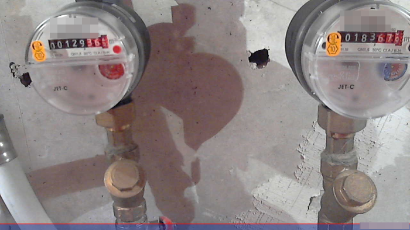
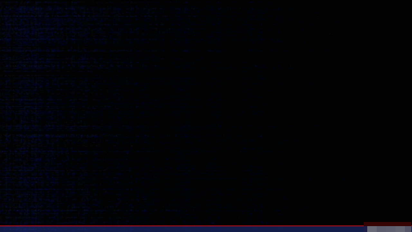
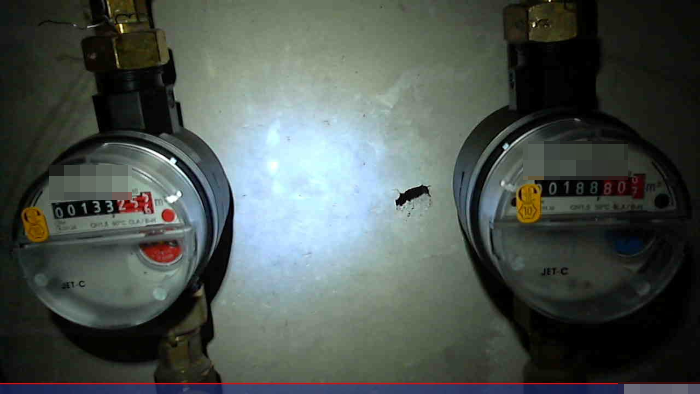
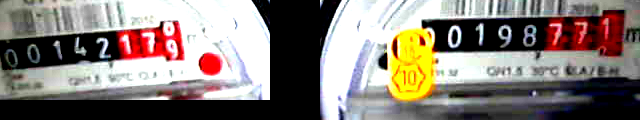
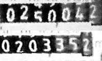

> This post is a recollection of a project that took place about 13 years ago, so details might be hazy and the actual implementation might be either easier or more involved, depending on the tech used.

### Preamble

Back in the day, my apartment had hot & cold water meters mounted above the ceiling of my bathroom that served as the water meters for the whole place. The ceiling had these tiles you'd remove[^1] in order to access the area where the meters were stored, so it wasn't like the meters were immediately visible when you step into the bathroom. It was my task, at the beginning of every month, to grab a chair, lift up one of the ceiling tiles, and record the numbers on the water meters to then send it to the building's maintenance team who also handled billing for utilities. This was a few years before the maintenance team swapped out these manual meters for the more convenient ones that transmitted their data wirelessly to a nearby device, so there was no going around the manual inspection of the gauges.

Perhaps it goes without saying, but I quickly got tired of this task. I know it only happened once every month, but I'm naturally a lazy person when faced with such a mundane task. Additionally, I'm not the best at multi-tasking, especially when the tasks to juggle are balancing on a chair while trying not to fall and injure myself, observing numbers from a distance and then writing those numbers on a pad and remembering which numbers go to which meter. So, I sought out a means of automating all of this. I reasoned if I could just remove the need to get up into the tiled part of my ceiling, this would be a big win for productivity. Before I could really get to work on a solution, though, I need to define some goals...

### Goals
In order for this project to be a success and actually save me the time & effort, it would need to:
 - Last months with no interaction needed ("vacation safe")
 - Have a light source to use to better see the water meter without the tiles removed (the bathroom's lights were mounted on the tiles, so the meter's space was dark)
 - Have a means of communicating the meter info in a consistently legible manner (no manual do-overs allowed)
 - Communicate the meter info in a way that I'm able to see it even when I'm away from the apartment (in case I'm on vacation)

### Implementation
For this project (and more importantly, during this particular time), I chose to go with something relatively low-power like a Raspberry Pi. I needed something that didn't consume a lot of energy, but something that could handle extracting an image through a camera. I think nowadays I'd probably go with something even more lightweight like an ESP32 with a camera module.

This was back before Raspberry Pis even had built-in WiFi modules, too, so I had to do some research about what WiFi USB dongle would best be compatible with the RasPi. Fortunately, that wasn't too hard of a task. Instead of purchasing the camera module that was best compatible with the RasPi, I opted for a cheaper solution and took an old USB webcam I had laying around. I figured if it turned difficult to get the RasPi to 'see' the device, I could then purchase the actual camera module.

Fortunately, after some tinkering, the camera module ended up working out just fine and I ended up writing a script that would take a pic and email it to me. I scheduled the script by using `crontab` in my Linux-flavored RasPi. 

Here's an early practice shot of how the meters looked with the bathroom lights on:

...but also, here's how the meters looked without the lights on :))

So, I had the largest problems resolved (getting the images to me from anywhere), I just needed to figure out how to set up lighting... Again, I set off to tinker.

An interesting problem arose with this side of the project. If I used too many lights, or a light that's too powerful, the power would drain from the RasPi (or its components like the WiFi dongle or -- more importantly -- the USB camera that also needed to be on while the lights are on). Thinking I needed something that just 'sips' the electricity, I tried a few bare LEDs in what I thought was a pretty lightweight circuit. It turned out to be not enough light focused on the meters. Another issue was that each meter was far enough away from the other that having a single light source just wouldn't cut it. I'd need one light source for each meter, or I'd need a way to balance the lighting just well enough to get each meter lit up.

After experimenting with some spare LEDs I had laying around, the issue I discovered with them is that they're just not individually bright enough for the camera to pick up. Additionally, only a fraction of the light emitted was actually going where i wanted it to, and I didn't really feel like playing around with reflective dishes to try to optimize that solution. I did, however, have a spare headlamp that also happened to be 3V, which was close enough to RasPi's standard for me to attempt controlling the light through one of the RasPi's GPIO pins. A few trials getting the script sequence down, I was able to get a well-enough lit photo from the same power source as the RasPi!

That's it, problem solved, right? Well, true to my overengineering nature, it wasn't good enough. I let the script run over weeks and recorded what issues I had with using it. After recognizing some recurring themes, I realized that I wanted a cleaner result. I dove into documentation about automated image processing. I realized that I should boost the saturation & contrast of the image, and possibly crop the meters closer together to make reading from my phone an almost trivial task.

It's also around this time that I tried out Optical Character Recognition (OCR) to try and get the computer to guess the numbers for me so I wouldn't even need to handle the transcription part. While that was mostly successful, I worried about relying too heavily on that side of the process and opted to just focus on getting the images cleaned up before being sent out. Transcription after that isn't much of a chore anyway.

With some experimentation, I ended up with the following:

Now this was an improvement! This solution lasted many months, perhaps even a year before I realized that I probably could crop it just a little bit more, stack the numbers on top of each other and (after yet more experimentation) convert it to greyscale, which seemed to help with reading the numbers from a cheap phone screen:

This is the process that lasted for a few more years until the building maintenance team decided to swap out the meters for upgraded, remote-read capable ones. 

### Conclusion

I look back fondly at this project. In many ways, it was my first practical home automation project. I had built temperature logging devices before this (and consequently written a bunch of temperature analysis & correlation scripts in R), but this was the first project that actually made my life easier instead of the others that merely sought to uncover more data hidden in the world around me. Both pursuits were fun & worthwhile, but this one in particular proved to me that there can be a very practical use with seemingly trivial devices if the need is there. This project led me to experiment more with writing in Python (before, I was still mainly writing in Visual Basic and R for work) - a programming language that I now use for the bulk of both work and personal projects. I'm not sure if I owe my entire interest in Python programming to this project's success, but I'm certain that it helped me find a way forward to exploring Python more in-depth.

[^1]: much like what you may see in a typical American office -- that was the first apartment bathroom that I had seen them used, at least